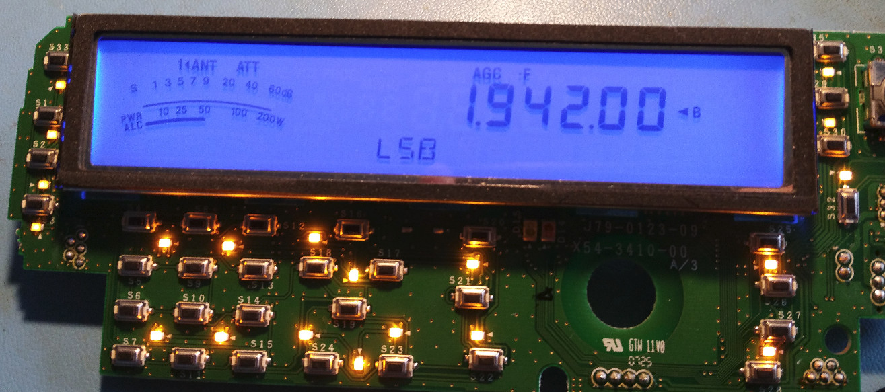
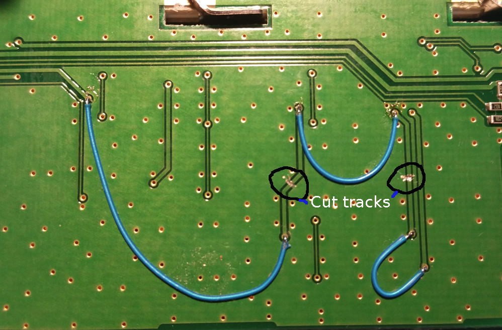

# Kenwood TS-480 blue display

This is a guide to changing the Kenwood TS-480 display illumination from orange/yellow to blue.

Youtube video https://youtube.com/?ssssss

## Disclaimer

I take no responsibility for any damage or loss caused by following these instructions. They are provided **as-is** on a **best effort** basis and may contain **errors or omissions** I am unaware of.

If you are not experienced in fine surface mount soldering I absolutely recommend not to proceed and contact a reputable technician / engineer to have the modification done.

Please also note that I will not carry out this modification for you. I have a full time job and the last thing I want to do is more work after hours. Hope you understand!

## Required parts

- 8 x LTST-S110TBKT side blue LED (datasheet here: )
- 20 x 0805 blue LED
- 3 x 0805 100ohm resistors
- 1 x 0805 330ohm resistor

## Disassemble the display unit

Follow the process below

1. Remove 3 screws on the rear of the face
2. Separate the front and back parts of the face
3. Remove the speaker plug (CN2)
4. Turn face towards you
5. Remove AF and SQL knobs noting the AF knob has a white marking on it for refitting
6. Remove Multi and IF Shift knobs
7. Remove clarifier knob, this was very tight on the units I have done and will require some fiddling around, be sure to protect the face from marks if you use tools
8. Remove the rubber from VFO knob
9. Undo nut from AF / SQL control and remove control along with sub board
10. Undo nut from MULTI / IF SHIFT control and remove control along with sub board
11. Using Allen key, loosen and remove VFO knob from the encoder shaft
12. Undo the nut holding VFO encoder, unplug CN5 which attaches encoder wiring to PCB and remove encoder

## LCD display illumination replacement

The TS-480 uses 8 surface mount LED to illuminate the LCD display with a yellowish color.

The original yellow LED require around 1.4v to light however the replacement blue LED require around 3v.

This modification therefore requires not only a replacement of the LED but also some track cutting, jumper (bodge) wires and resistor changes since 4 blue LED in series will not light on the supplied voltage.

Please see the diagram showing the LCD illumination circuit below:

### LCD assembly removal

The LCD is attached to the PCB by bent lugs. To remove it, with care you straighten each lug so it fits through the slot in the PCB. Once all lugs are straight carefully remove the LCD assembly.

### Left hand side LED

- Remove the 4 LED (D1, D3, D10 & D12)
- Cut the track between D3 and D10
- Install the blue LED (LTST-S110TBKT) to the pads vacated by D1, D3, D10 & D12
- Wire anode of D3 to anode of D12
- Wire cathode of D10 to cathode of D1

Outline:

In progress view prior to wiring:

Completed view with wiring installed:

### Right hand side LED

- Remove the 4 LED (D2, D4, D11 & D13)
- Cut the track between D4 and D11 pictured below
- Install the blue LED (LTST-S110TBKT) to the pads vacated by (D2, D4, D11 & D13)
- Wire anode of D4 to anode of D13
- Wire cathode of D11 to cathode of D2

Outline:

In progress view prior to wiring:

Completed:

### Resistor replacements

R11 and R12 need to be replaced to make the brightness steps reasonable.

Replace R11 56ohm with 100ohm (0805) as per diagram below:

Replace R12 56ohm with 100ohm (0805) as per diagram below:

### LCD assembly replacement

Reattach the LCD assembly to the PCB taking care to align it correctly. Bend the lugs to secure it to the PCB as it was before removal.

### Test the LCD illumination

At this point you can test to confirm all is good before moving onto the keyboard part. Hopefully you have a result like here:

## Keyboard illumination replacement

The rubber keyboard is illuminated by a number of surface mount LED placed around the PCB. The keyboard LED's are in strings of 2 to 4 with different resistors to maintain a consistent brightness level of the keyboard. The supply is the same 8m (9.45v) line that the LCD LED are powered from.

To change to the blue LED a couple of modifications must be made similar to the LCD display as the blue LED require a higher voltage. Also two LED are replaced by resistors.

- Replace D31, D32, D33, D34, D35 and D36 with blue LED
- Replace D24, D25 and D26 with blue LED
- Replace LED D18, D17 and D16 with blue LED
- Replace LED D19 (near AT key) with 100ohm resistor
- Replace LED D27, D29 and D30 with blue LED
- Replace LED D28 (between FINE and SCAN) with a 100ohm resistor
- Replace R35 180ohm with 330ohm (0805)
- Replace LED D20, D21, D22 and D23 with blue LED
- Cut trace between D20 and D21 on rear of PCB
- Cut trace between D22 and D23 on rear of PCB
- Jumper wire between cathode of D21 and anode of D23 on rear of PCB
- Jumper wire between anode of D20 and anode of D21 on rear of PCB
- Jumper wire between cathode of D21 and cathode of D23 on rear of PCB

Photo of LED string D20 – D23 modifications on rear of PCB:

## Change the RX LED to blue

Optionally, you can change the RX LED from green to blue by swapping D15 to the same LED as used in the LCD area. To reduce the brightness swap R25 from 220ohm to 750ohm or 1k.

Last updated 2024-06-16

